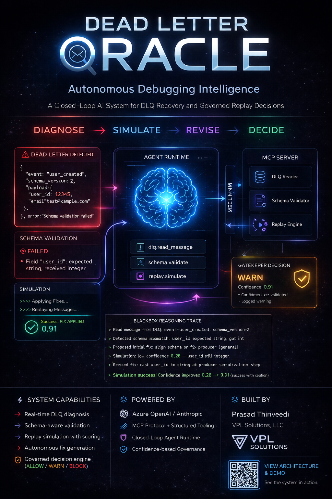

# Dead Letter Oracle

**Governed MCP Agent for DLQ Incident Resolution**

[](https://github.com/tvprasad/dead-letter-oracle/actions/workflows/ci.yml)
[](https://www.python.org/)
[](LICENSE-2.0.txt)
[](https://github.com/tvprasad/dead-letter-oracle/releases)
[](https://modelcontextprotocol.io)
[](https://github.com/agentgateway/agentgateway)
[](https://github.com/tvprasad/dead-letter-oracle#llm-provider)



Dead Letter Oracle is an MCP-based agent that analyzes failed dead-letter queue messages, explains root causes, proposes and simulates fixes, and makes governed replay decisions, with a full reasoning trace.

---

## Problem

In event-driven systems, failed messages require manual debugging:

- Root cause is unclear from the error alone
- Schema mismatches are hard to diagnose without tooling
- Replay decisions are made without confidence scoring or governance

---

## Solution

Dead Letter Oracle automates the full incident loop:

1. Reads the failed DLQ message via `dlq_read_message`
2. Validates the payload via `schema_validate`
3. LLM proposes an initial fix (high-level direction)
4. `replay_simulate` tests the fix and returns a confidence score
5. If confidence is low, LLM revises with a concrete, operational fix
6. `replay_simulate` re-evaluates the revised fix
7. Gatekeeper issues ALLOW / WARN / BLOCK with multi-factor reasoning
8. BlackBox renders the full 7-step reasoning trace

---

## Architecture

```
User → CLI (main.py)
     → Agent API (POST /run-incident, port 8000)
     → AgentGateway Playground (agent_run_incident tool, port 3000)
                │
                ▼
        AgentGateway (port 3000)
        CORS, session tracking, web UI
                │
                ▼
          MCP Server (mcp_server/)
          ├── dlq_read_message       deterministic
          ├── schema_validate        deterministic
          ├── replay_simulate        deterministic
          └── agent_run_incident     orchestration
                    ├── calls above tool functions (in-process)
                    ├── LLM  (propose → simulate → revise)
                    ├── Gatekeeper  (ALLOW / WARN / BLOCK)
                    └── BlackBox    (reasoning trace)
```

All four tools are accessible via AgentGateway at port 3000. The MCP protocol boundary is real. The three deterministic tools have no LLM dependency. `agent_run_incident` composes them with LLM interpretation and governance — one protocol surface, all capabilities.

---

## Running with AgentGateway

Dead Letter Oracle ships with an [AgentGateway](https://github.com/agentgateway/agentgateway) configuration that exposes both the MCP tools and the governed agent API behind a single proxy with built-in CORS, session tracking, and a live web UI.

Dead Letter Oracle exposes two surfaces:

- **MCP tools** via AgentGateway (port 3000) — `dlq_read_message`, `schema_validate`, `replay_simulate`
- **Agent API** (port 8000) — `POST /run-incident` runs the full 7-step governed pipeline and returns the reasoning trace and gatekeeper decision as JSON

```bash
# Install agentgateway (Linux/macOS)
curl -sL https://agentgateway.dev/install | bash

# Windows: download binary from https://github.com/agentgateway/agentgateway/releases
# then run:
agentgateway-windows-amd64.exe -f agentgateway/config.yaml

# Start the gateway (MCP tools)
agentgateway -f agentgateway/config.yaml

# Start the agent API (full governed pipeline)
python -m agent.api
```

| Endpoint | URL |
|----------|-----|
| MCP proxy | http://localhost:3000/ |
| Agent API | http://localhost:8000/run-incident |
| Agent docs | http://localhost:8000/docs |
| Web UI | http://localhost:15000/ui |
| Playground | http://localhost:15000/ui/playground/ |

Open the Playground, connect to `http://localhost:3000/`, and invoke `dlq_read_message`, `schema_validate`, or `replay_simulate` directly from the browser. To run the full governed pipeline via HTTP, `POST http://localhost:8000/run-incident` with `{"file_path": "data/sample_dlq.json"}`.

The gateway config is at [`agentgateway/config.yaml`](agentgateway/config.yaml).

---

## Quickstart

```bash
pip install -r requirements.txt
cp .env.example .env
# fill in LLM credentials (see .env.example)
python main.py
```

### LLM Provider

Set `LLM_PROVIDER` in `.env`:

| Value | Required vars |
|-------|--------------|
| `azure_openai` (default) | `AZURE_OPENAI_API_KEY`, `AZURE_OPENAI_ENDPOINT`, `AZURE_OPENAI_DEPLOYMENT` |
| `anthropic` | `ANTHROPIC_API_KEY`, `ANTHROPIC_MODEL` |
| `ollama` | `OLLAMA_BASE_URL`, `OLLAMA_MODEL` |

> Tested with Ollama (llama3) for local and air-gapped deployment, relevant for enterprise and federal environments where cloud API calls are restricted.

### Running tests

```bash
python -m pytest tests/ -v
```

---

## MCP Tools

| Tool | Type | Input | Output |
|------|------|-------|--------|
| `dlq_read_message` | Deterministic | `file_path` | Parsed DLQ message |
| `schema_validate` | Deterministic | `payload`, `expected_schema` | `valid`, `errors[]` |
| `replay_simulate` | Deterministic | `original_message`, `proposed_fix` | `confidence`, `success_likelihood`, `reason` |
| `agent_run_incident` | Orchestration | `file_path` | Gatekeeper decision + 7-step BlackBox trace |

---

## Gatekeeper Factors

Multi-factor evaluation, not a simple if/else:

- **Schema** — mismatch detected / resolved
- **Simulation** — confidence score from `replay_simulate`
- **Fix** — whether a confirmed fix was applied
- **Environment** — prod requires higher confidence threshold

---

## Project Structure

```
mcp_server/      MCP server + tools (deterministic)
agent/           Agent runtime, planner, LLM integration, HTTP API
governance/      Gatekeeper — multi-factor replay evaluation
observability/   BlackBox — structured reasoning trace
agentgateway/    AgentGateway config (MCP proxy + agent API, web UI, playground)
data/            Sample DLQ message (local, no Kafka)
adr/             Architecture Decision Records (ADR-001 through ADR-009)
tests/           22 unit + integration tests
docs/            Architecture poster (poster.png)
```

---

## Hackathon Context

Developed during the AI Hackathon submission period (Feb 2 – Apr 3, 2026).

Built ADR-first: each phase locked decisions before implementation. The deliberate first-fix failure (confidence 0.28 → 0.91) is the core demo moment. It proves the agent reasons, not just formats.

---

## Author

**Prasad Tiruveedi** — [linkedin.com/in/-prasad](https://www.linkedin.com/in/-prasad/) | VPL Solutions LLC

---

## Acknowledgements

**Design review:** Venkat, Satish, and Vijaya — feedback on system positioning and poster design.

**Development approach:** Built using an agent team orchestrated by a human architect — each tool assigned a distinct role, mirroring the multi-component design of the system itself.

**AI tools used during development:**
- Claude Code — implementation, architecture, and testing
- ChatGPT — ideation, prompt refinement, and poster generation
- Gemini — ideation and design feedback
- GitHub Copilot — ideation and testing
- Ollama (llama3) — local LLM validation and air-gap testing

## License

Apache License 2.0 — see [LICENSE-2.0.txt](LICENSE-2.0.txt)
